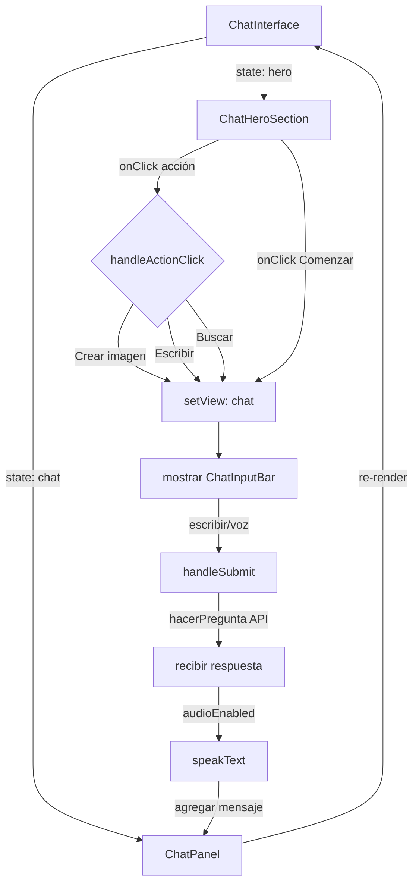

# 🤖 Nueva Interfaz de Chat - Documentación

## Descripción General

Se ha implementado una nueva interfaz moderna de chatbot estilo ChatGPT/Claude con tema oscuro, similar a la imagen de referencia proporcionada.

### URL de Acceso
- **Producción**: `/preguntas/new`
- **Desarrollo**: `http://localhost:3000/preguntas/new`

---

## 🎯 Características Principales

### 1. **Pantalla Hero Inicial**
- Título motivacional: "Asistente IA"
- Descripción atractiva
- 3 botones de acción rápida:
  - 📷 Crear imagen
  - ✍️ Escribir o editar
  - 🔍 Buscar información
- Animaciones suaves y gradientes modernos

### 2. **Panel de Chat**
- Historial de conversaciones limpio
- Mensajes con avatares diferenciados (Usuario en gradiente cyan-blue, IA en gradiente verde)
- Timestamps para cada mensaje
- Animación de escritura mientras responde la IA
- Botón para limpiar historial

### 3. **Input Bar Mejorado**
- Textarea auto-redimensionable
- Botón de envío inteligente (deshabilitado si está vacío)
- Botón de micrófono con indicador visual
- Estado focus con efecto glow cyan
- Acciones rápidas flotantes

### 4. **Controles de Audio**
- ✅ Reconocimiento de voz (Web Speech API)
- ✅ Síntesis de voz (Text-to-Speech)
- Toggle de audio en header
- Indicadores visuales de estado activo

---

## 📁 Estructura de Componentes

```
src/components/chat/
├── ChatInterface.tsx          # Contenedor principal (lógica + orquestación)
├── ChatHeroSection.tsx        # Pantalla inicial
├── ChatPanel.tsx              # Área de chat/historial
├── ChatInputBar.tsx           # Input + botones de acción
├── ChatMessage.tsx            # Componente de mensaje individual
├── ActionButton.tsx           # Botón de acción rápida
├── AudioControls.tsx          # Controles de audio/micrófono
└── index.ts                   # Exportaciones
```

---

## 🛠️ Tecnologías Utilizadas

- **React 18** - Componentes con hooks
- **TypeScript** - Type safety
- **Tailwind CSS** - Estilos (tema oscuro)
- **Web Speech API** - Reconocimiento de voz
- **Speech Synthesis API** - Síntesis de voz
- **Next.js 15** - Framework full-stack

---

## 📊 Flujo de la Aplicación



---

## 🎨 Paleta de Colores

| Elemento | Color | Tailwind |
|----------|-------|----------|
| Fondo principal | Negro | `bg-slate-950` |
| Elementos secundarios | Gris oscuro | `bg-slate-900` |
| Bordes | Gris muy oscuro | `border-slate-800` |
| Texto principal | Blanco | `text-slate-100` |
| Texto secundario | Gris claro | `text-slate-400` |
| Accent (botones) | Cyan | `bg-cyan-500` |
| Usuario (avatar) | Gradient cyan-blue | `from-cyan-500 to-blue-600` |
| IA (avatar) | Gradient verde | `from-emerald-500 to-green-600` |
| Error/Micrófono activo | Rojo | `bg-red-500` |

---

## 🔧 Configuración y Setup

### Instalación de Dependencias
```bash
npm install
```

### Variables de Entorno
Asegúrate de que `.env` contiene:
```
NEXT_PUBLIC_BACKEND_URL=http://tu-backend-api.com
```

### Desarrollo Local
```bash
npm run dev
```

Accede a `http://localhost:3000/preguntas/new`

---

## 🚀 Funcionalidades Implementadas

### ✅ Completadas

1. **Chat Interactivo**
   - Envío de mensajes con Enter
   - Shift+Enter para nueva línea
   - Historial persistente en sesión

2. **Reconocimiento de Voz**
   - Captura de entrada por micrófono
   - Lenguaje: Español (es-ES)
   - Visualización de estado de grabación

3. **Síntesis de Voz**
   - Lectura automática de respuestas
   - Control de activación/desactivación
   - Cancelación inteligente

4. **Diseño Responsivo**
   - Mobile-first
   - Funciona en tablets y desktop
   - Textarea adaptable

5. **Animaciones**
   - Transiciones suaves
   - Glow effects en elementos activos
   - Animación de "escribiendo..."

---

## 🔄 Integración con API

### Endpoint Utilizado
```
POST /api/aichat/preguntar?agente=true
```

**Body:**
```json
{
  "pregunta": "Tu pregunta aquí"
}
```

**Response:**
```json
{
  "respuesta": "Respuesta de la IA"
}
```

---

## 🎯 Casos de Uso

### 1. Usuario selecciona acción rápida
```
1. Click en "Crear imagen" / "Escribir" / "Buscar"
2. Transición a vista de chat
3. Mensaje de contexto de la IA
4. Input listo para pregunta específica
```

### 2. Usuario usa reconocimiento de voz
```
1. Click en micrófono
2. Hablar en español
3. Transcript aparece en input
4. Click en envío o presionar Enter
5. IA responde y lee la respuesta
```

### 3. Usuario limpia historial
```
1. Click en "Limpiar chat"
2. Historial se vacía
3. Panel muestra estado vacío
```

---

## 📱 Responsive Breakpoints

- **Mobile**: < 640px
- **Tablet**: 640px - 1024px
- **Desktop**: > 1024px

---

## 🐛 Troubleshooting

### Reconocimiento de voz no funciona
- Verificar permisos del navegador
- Usar HTTPS en producción
- Soportado en: Chrome, Edge, Safari, Firefox

### Síntesis de voz no funciona
- Verificar que `audioEnabled` está en true
- Comprobar volumen del sistema
- Algunos navegadores requieren interacción previa

### Mensajes no se envían
- Verificar que `NEXT_PUBLIC_BACKEND_URL` está correcto
- Revisar respuesta de API en Network tab
- Comprobar CORS en backend

---

## 🎓 Mejoras Futuras

- [ ] Guardar historial en base de datos
- [ ] Exportar conversaciones (PDF/TXT)
- [ ] Temas personalizables
- [ ] Historial de búsqueda rápida
- [ ] Compartir chats
- [ ] Modo oscuro/claro
- [ ] Soportar múltiples idiomas
- [ ] Integración con APIs externas (imágenes, búsqueda)

---

## 📞 Soporte

Para reportar problemas o sugerencias:
1. Revisar este documento
2. Verificar console del navegador (F12)
3. Comprobar Network tab en DevTools
4. Contactar al equipo de desarrollo

---

**Última actualización**: 2026-06-17  
**Versión**: 1.0.0
